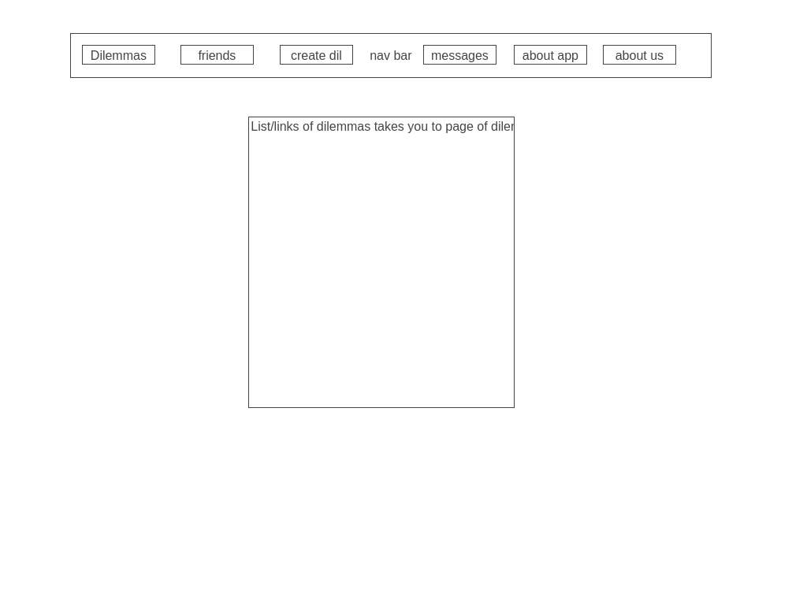

# Authors
## Sean Hawkins, Amber Falbo, Alex Angelico, Sam Clark 

# Project 
## Let's Git Ethical 
---
<!-- ### We are deployed on REACT!

[project url here] -->


## **Let’s Git Ethical**

**Summary:** An application that allows you to go through various moral dilemmas. When going through moral dilemmas, you can see how your answers compare with other users. In addition, customize your own profile, and connect with users that have similar ethical standards OR not. Maybe you want a challenge on the date and to discuss your vastly different perspectives.

**We don’t care about your gender of size. We just want ya’ll to harmonize.**


Pain Point: Have you ever wondered how you might respond in various moral dilemmas? Well now you can go through a set of moral dilemmas and find out what kind of person you really are. You can also see how your ethical standards align with other users, and even include your own dilemmas. If accepted, your unique dilemma can be added to the API! 

**MVP:**
Each moral dilemma will have a corresponding visual. Each moral dilemma will be multiple choice and have follow-up questions to extend the scope of the dilemma. Users will be able to see how their answers match up with others.
In addition, connect with other users to discuss moral dilemmas in a dedicated comment section. Users can submit new moral dilemmas (optional photo) to our own API. We as admins will then decide whether to approve and include it in our application.
Users will have dedicated profiles and can connect with each other and see how much their ethics align. Users can privately message each other and have their own debates. Moreover, users can link their Facebook, Instagram, and LinkedIn accounts to their profiles. Profiles can optionally have a thumbnail photo, header, and bio section.
Potential Stretch Goals:
Generate a page of users that have ethical standards most like your own.
Create the ability for users to add other users to a friends list.
Add the ability for users to use emojis in comments and private messages.
Add an ability for users to have their own walls where they can make various posts.
Add a feed where users can see their friend’s posts.

The web application consists of a frontend written in HTML, CSS,
Bootstrap/Tailwind, and jQuery. The backend was written in Python/

An interface is provided to create new blog
posts, view existing blog posts, edit existing blog posts, delete existing
blog posts, and search by both keywords and usernames.

---

## Tools Used
VS Code
PyCharm

- Python
- Django
- Docker
- MVC
- Bootstrap/Tailwind
- Pytest

---

## Trello Board
```
https://trello.com/b/qeJ8FHxG/lets-git-ethical
```

---
## Recent Updates

#### V 1.0
*TBA* - April " "

---

## Getting Started

Clone this repository to your local machine.

```
$ git clone https://github.com/Team-Pythog/lets-git-ethical.git
```
Once downloaded, activate your virtual environment and run by ____________
```
cd Team-Pythog/lets-git-ethical
python build
```


---

## Usage

### Homepage


### User Profile


### Messages


### Moral Dilemma


### Create Moral Dilemma


### Friends


### Dilemmas Homepage


### About Us


### About App Page


### Login Page


### Sign Up Page


---

## Data Model


### Overall Project Schema/ ERD
***[Add a description of your DB schema. Explain the relationships to me.]***


### User
(database)

---

## Resources

How to Use JWT Authentication with Django REST Framework

https://simpleisbetterthancomplex.com/tutorial/2018/12/19/how-to-use-jwt-authentication-with-django-rest-framework.html


How To Build a To-Do application Using Django and React

https://www.digitalocean.com/community/tutorials/build-a-to-do-application-using-django-and-react


Build a Social Media Website with Django

https://towardsdatascience.com/build-a-social-media-website-with-django-users-app-part-2-7f0c0431ccdc


django-storages and AmazonS3

https://www.youtube.com/watch?v=DP_egE7gevk&list=PLNgJzt3h5CSoHIlLvmCG80HQdu-KBf431&ab_channel=GoDjango


---


# Next.js + Tailwind CSS Example

This example shows how to use [Tailwind CSS](https://tailwindcss.com/) (v2.1) with Next.js. It follows the steps outlined in the official [Tailwind docs](https://tailwindcss.com/docs/guides/nextjs).

It uses the new [`Just-in-Time Mode`](https://tailwindcss.com/docs/just-in-time-mode) for Tailwind CSS.

## Deploy your own

Deploy the example using [Vercel](https://vercel.com?utm_source=github&utm_medium=readme&utm_campaign=next-example):

[](https://vercel.com/new/git/external?repository-url=https://github.com/vercel/next.js/tree/canary/examples/with-tailwindcss&project-name=with-tailwindcss&repository-name=with-tailwindcss)

## How to use

Execute [`create-next-app`](https://github.com/vercel/next.js/tree/canary/packages/create-next-app) with [npm](https://docs.npmjs.com/cli/init) or [Yarn](https://yarnpkg.com/lang/en/docs/cli/create/) to bootstrap the example:

```bash
npx create-next-app --example with-tailwindcss with-tailwindcss-app
# or
yarn create next-app --example with-tailwindcss with-tailwindcss-app
```

Deploy it to the cloud with [Vercel](https://vercel.com/new?utm_source=github&utm_medium=readme&utm_campaign=next-example) ([Documentation](https://nextjs.org/docs/deployment)).
